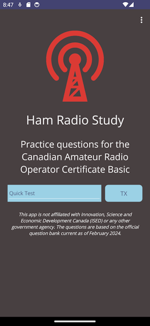
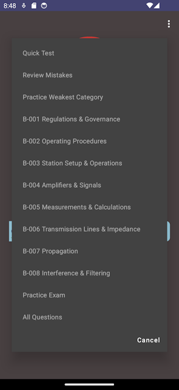
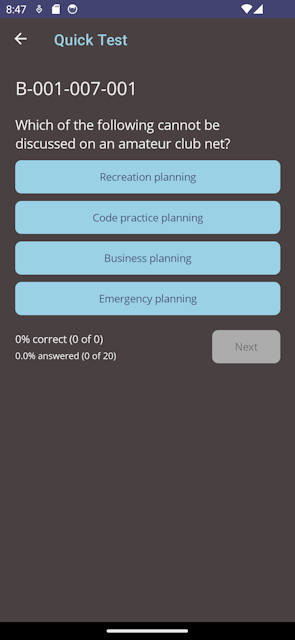
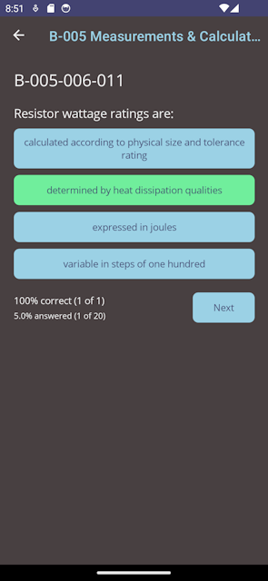

# Ham Radio Study

Practice study question app for the Canadian Amateur Radio Operators Certificate Basic.

_This app is not affiliated with Innovation, Science and Economic Development Canada (ISED) 
or any other government agency. The questions are based on the official question bank current 
as of February 2024._

## Features

- Track which questions you've answered and if they were correct
- Take a practice test of 100 questions from the official question bank
- Take a quick test of 20 random questions
- Review any of the eight sections of the tests
- Review question that you got wrong
- Review the section that your are weakest in
- View statistics of your test results
- Quizes from [YLab's Free Canadian Amateur Radio License Training Class](https://www.ylab.ca/radioclass/). Make sure you check out their great learning materials and YouTube videos.

## Main Screen

## Tests Available

## Question Screen

## Answered Question

